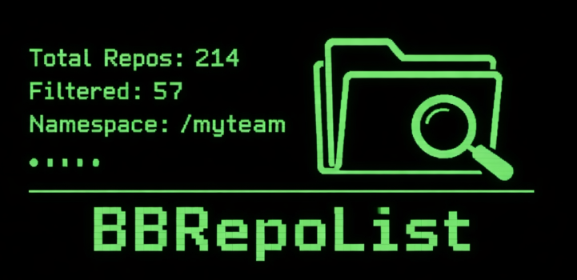
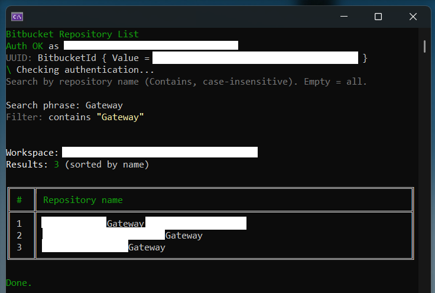

# BBRepoList



## About
BBRepoList is a lightweight console utility for listing repositories in a Bitbucket workspace.

It supports:
- Name filtering (`contains`, case-insensitive)
- Repository metadata (`Created on`, `Last updated`)
- Open pull request count per matched repository
- Additional summary tables:
- `Repositories with open pull requests`
- `Abandoned repositories`

## Bitbucket REST API
This app uses the Bitbucket Cloud REST API:

`https://developer.atlassian.com/cloud/bitbucket/rest/`

## Configuration (`appsettings.json`)
Example:

```json
{
  "Bitbucket": {
    "BaseUrl": "https://api.bitbucket.org/2.0",
    "Workspace": "your-workspace",
    "AuthEmail": "user@example.com",
    "AuthApiToken": "your-api-token",
    "PageLen": 50,
    "RetryCount": 2,
    "LoadOpenPullRequestsStatistics": false,
    "AbandonedMonthsThreshold": 12
  }
}
```

Settings:
- `BaseUrl`: Base API endpoint.
- `Workspace`: Bitbucket workspace (namespace).
- `AuthEmail`: Bitbucket account email.
- `AuthApiToken`: Bitbucket API token.
- `PageLen`: Repositories per page.
- `RetryCount`: Retry count for transient API failures.
- `LoadOpenPullRequestsStatistics`: Enables/disables loading open pull request statistics. Default: `true`.
- `AbandonedMonthsThreshold`: Inactivity threshold in months for abandoned repositories. Default: `12`.

## Output
The app renders:
- Main repositories table with:
- `Repository name`
- `Created on`
- `Last updated`
- `Open pull requests`
- `Repositories with open pull requests` table (shown only when at least one repo has open PRs).
- `Abandoned repositories` table (shown only when inactivity is above the configured threshold), including:
- `Created on`
- `Last activity on`
- `Months inactive`

If `LoadOpenPullRequestsStatistics` is enabled, open PR count is resolved only for repositories that match the entered name filter.


