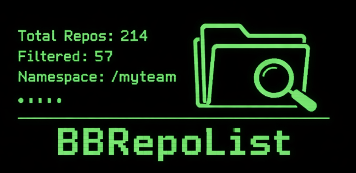
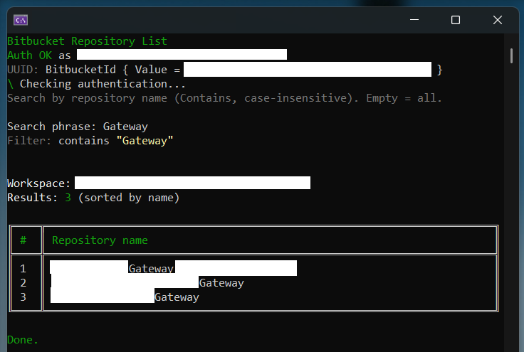
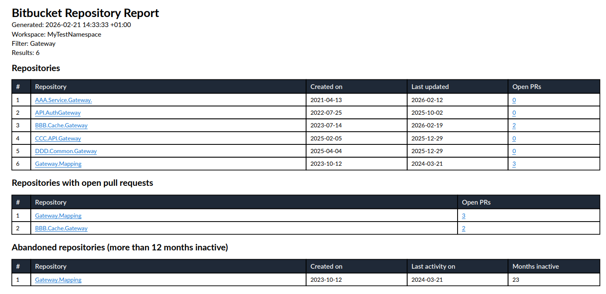

# BBRepoList



## About
BBRepoList is a lightweight console utility for listing repositories in a Bitbucket workspace.

It supports:
- Name filtering (`contains`, case-insensitive)
- Repository metadata (`Created on`, `Last updated`)
- Open pull request count per matched repository
- Optional open PR details report (`TTFR`, `Open for`, my comments marker)
- Additional summary tables (`Repositories with open pull requests`, `Abandoned repositories`)
- PDF report export (QuestPDF)

## Bitbucket REST API
This app uses the Bitbucket Cloud REST API:

`https://developer.atlassian.com/cloud/bitbucket/rest/`

## Configuration (`appsettings.json`)
Example:

```json
{
  "Bitbucket": {
    "BaseUrl": "https://api.bitbucket.org/2.0",
    "Workspace": "your-workspace",
    "AuthEmail": "user@example.com",
    "AuthApiToken": "your-api-token",
    "PageLen": 50,
    "RetryCount": 2,
    "Pdf": {
      "Enabled": true,
      "OutputPath": "bbrepolist-report.pdf"
    },
    "LoadOpenPullRequestsStatistics": false,
    "OpenPullRequestsLoadThreshold": 4,
    "PullRequestDetails": {
      "IsEnabled": false,
      "TtfrThresholdHours": 4
    },
    "AbandonedMonthsThreshold": 12
  }
}
```

Settings:
- `BaseUrl`: Base API endpoint.
- `Workspace`: Bitbucket workspace (namespace).
- `AuthEmail`: Bitbucket account email.
- `AuthApiToken`: Bitbucket API token.
- `PageLen`: Repositories per page.
- `RetryCount`: Retry count for transient API failures.
- `Pdf.Enabled`: Enables/disables PDF report generation. Default: `true`.
- `Pdf.OutputPath`: PDF file path (date suffix is added automatically).
- `LoadOpenPullRequestsStatistics`: Enables/disables loading open pull request statistics. Default: `true`.
- `OpenPullRequestsLoadThreshold`: Max number of concurrent PR-statistics requests when enabled. Default: `4`.
- `PullRequestDetails.IsEnabled`: Enables/disables loading open PR details report. Default: `false`.
- `PullRequestDetails.TtfrThresholdHours`: TTFR threshold in hours. When no first non-author response exists and open PR age exceeds this value, TTFR cell shows red `ALERT`. Default: `4`.
- `AbandonedMonthsThreshold`: Inactivity threshold in months for abandoned repositories. Default: `12`.

## Output
The app renders:
- Main repositories table with `Repository name`, `Created on`, `Last updated`, `Open pull requests`.
- `Repositories with open pull requests` table (shown only when at least one repo has open PRs), ordered by `Created on` (oldest -> newest).
- `Open PR details` table (shown only when `PullRequestDetails.IsEnabled` and open PRs exist), ordered by `Opened on` (newest -> oldest), including:
- `Open for` (time from PR creation until now)
- `TTFR` (time to first real non-author activity; red `ALERT` when there is still no first non-author activity after threshold)
- `My Comments` (`Yes` when current authenticated user has comments in PR activity)
- `Abandoned repositories` table (shown only when inactivity is above the configured threshold), including:
- `Created on`
- `Last activity on`
- `Months inactive`
- PDF report file with the same sections, where open PR details `My comments` is visualized with emoji marker.

If `LoadOpenPullRequestsStatistics` is enabled, open PR count is resolved only for repositories that match the entered name filter.

### Console output


### PDF output

