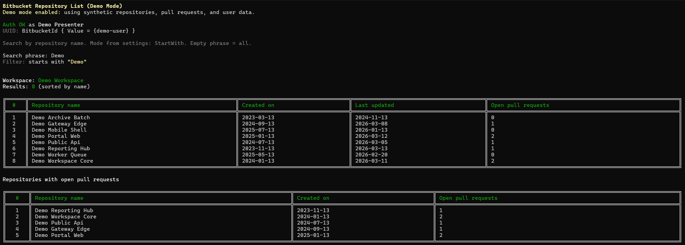
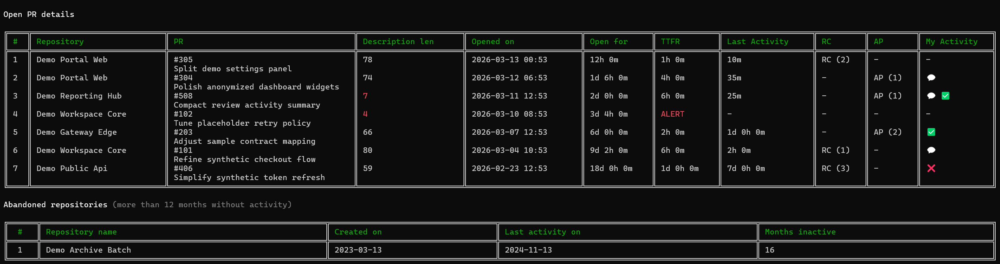
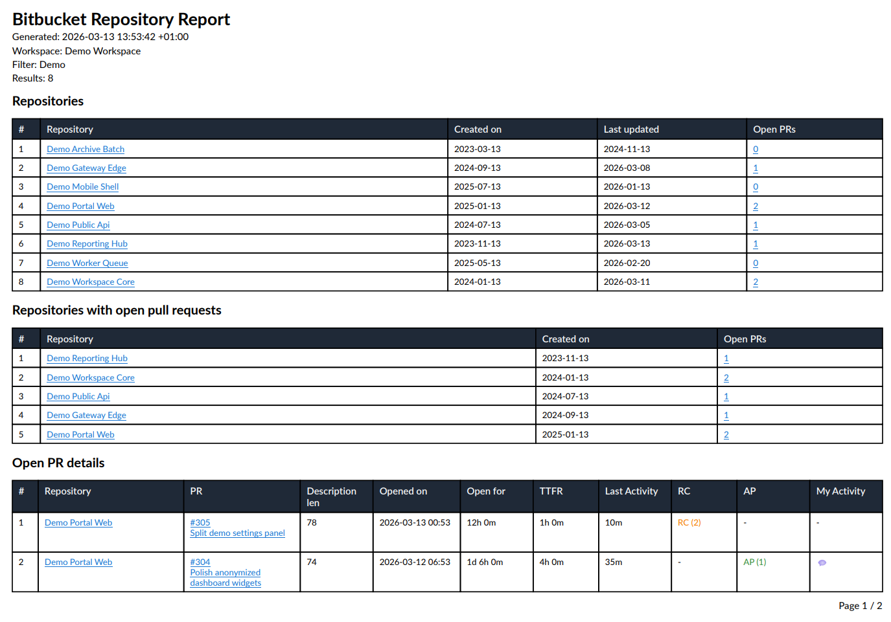
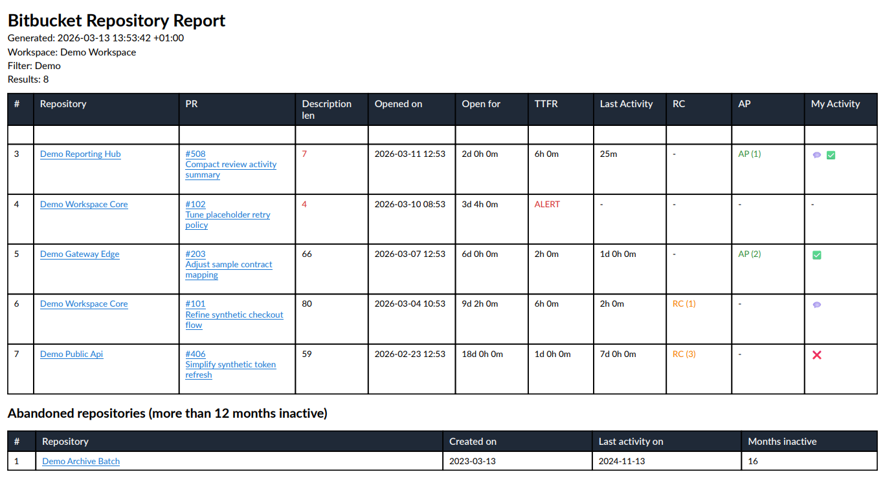
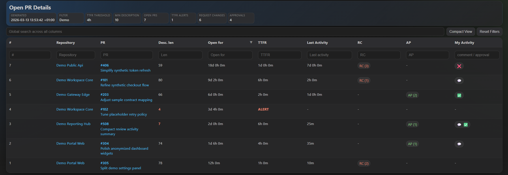

# BBRepoList


## About
BBRepoList is a lightweight console utility for listing repositories in a Bitbucket workspace.

It supports:
- Name filtering (`Contains` or `StartWith`, case-insensitive; `Contains` is default)
- Repository metadata (`Created on`, `Last updated`)
- Open pull request count per matched repository
- Optional open PR details report with review/activity signals (`Open for`, `TTFR`, `Last Activity`, `RC`, `AP`, `My Activity`)
- Additional summary tables (`Repositories with open pull requests`, `Abandoned repositories`)
- PDF report export (QuestPDF)
- Interactive HTML report export for open PR analysis

## Bitbucket REST API
This app uses the Bitbucket Cloud REST API:

`https://developer.atlassian.com/cloud/bitbucket/rest/`

## Configuration (`appsettings.json`)
Example:

```json
{
  "Bitbucket": {
    "BaseUrl": "https://api.bitbucket.org/2.0",
    "Workspace": "your-workspace",
    "AuthEmail": "user@example.com",
    "AuthApiToken": "your-api-token",
    "PageLen": 50,
    "RetryCount": 2,
    "Pdf": {
      "Enabled": true,
      "OutputPath": "bbrepolist-report.pdf"
    },
    "Html": {
      "Enabled": true,
      "OutputPath": "bbrepolist-open-pr-details.html"
    },
    "LoadOpenPullRequestsStatistics": true,
    "OpenPullRequestsLoadThreshold": 4,
    "PullRequestDetails": {
      "IsEnabled": true,
      "TtfrThresholdHours": 4,
      "MinimalDescriptionTextLength": 10,
      "LoadThreshold": 4
    },
    "AbandonedMonthsThreshold": 12,
    "LoadAbandonedRepositoriesStatistics": true,
    "RepositorySearchMode": "StartWith"
  }
}
```

Settings:
- `BaseUrl`: Base API endpoint.
- `Workspace`: Bitbucket workspace (namespace).
- `AuthEmail`: Bitbucket account email.
- `AuthApiToken`: Bitbucket API token.
- `PageLen`: Repositories per page.
- `RetryCount`: Retry count for transient API failures.
- `Pdf.Enabled`: Enables/disables PDF report generation. Default: `true`.
- `Pdf.OutputPath`: PDF file path (date suffix is added automatically).
- `Html.Enabled`: Enables/disables HTML report generation. Default: `true`.
- `Html.OutputPath`: HTML file path for the open PR details report (date suffix is added automatically).
- `LoadOpenPullRequestsStatistics`: Enables/disables loading open pull request statistics. Default: `true`.
- `OpenPullRequestsLoadThreshold`: Max number of concurrent PR-statistics requests when enabled. Default: `4`.
- `PullRequestDetails.IsEnabled`: Enables/disables loading open PR details report. Default: `false`.
- `PullRequestDetails.TtfrThresholdHours`: TTFR threshold in hours. When no first non-author response exists and open PR age exceeds this value, TTFR cell shows red `ALERT`. Default: `4`.
- `PullRequestDetails.MinimalDescriptionTextLength`: Minimal PR description text length. In the description length column, values below this threshold are shown in red. Default: `1`.
- `PullRequestDetails.LoadThreshold`: Max number of concurrent repository requests when loading open PR details report. Default: `8`.
- `AbandonedMonthsThreshold`: Inactivity threshold in months for abandoned repositories. Default: `12`.
- `LoadAbandonedRepositoriesStatistics`: Enables/disables loading abandoned repositories summary by inactivity condition. Default: `true`.
- `RepositorySearchMode`: Repository name search mode from configuration. Supported: `Contains`, `StartWith`. Default: `Contains`.

## Output
The app renders:
- Main repositories table with `Repository name`, `Created on`, `Last updated`, `Open pull requests`.
- `Repositories with open pull requests` table (shown only when at least one repo has open PRs), ordered by `Created on` (oldest -> newest).
- `Open PR details` table (shown only when `PullRequestDetails.IsEnabled` and open PRs exist).
- `Abandoned repositories` table (shown only when `LoadAbandonedRepositoriesStatistics` is enabled and inactivity is above the configured threshold), including `Created on`, `Last activity on`, `Months inactive`.
- PDF report file with the same report sections as the console output.
- HTML report file for open PR details.

Open PR details columns:
- `Repository`
- `PR`
- `Description len` / `Desc. len` (actual PR description length; red when length is below configured minimum)
- `Opened on` in console and PDF output
- `Open for` (time from PR creation until now)
- `TTFR` (time to first real non-author activity; red `ALERT` when there is still no first non-author activity after threshold)
- `Last Activity` (time since the latest PR activity)
- `RC` (request-changes count)
- `AP` (approval count)
- `My Activity` (current user activity markers for comments, request changes, approvals)

HTML report features:
- dark VS Code-like styling
- sortable columns
- global search
- per-column filters
- compact mode toggle

>For demonstration purposes, the program output shown in the screenshots uses synthetic data to avoid exposing information from real repositories.

### Console output



### PDF output



### Html output

